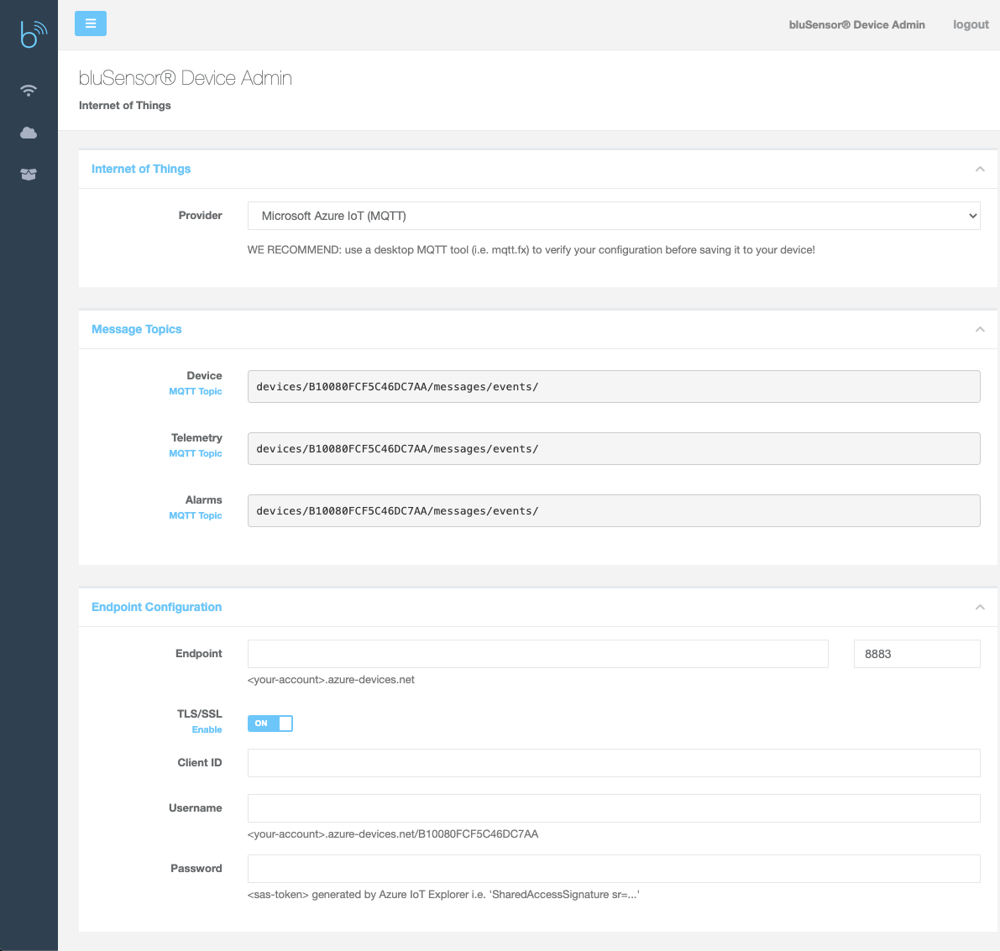

# bluSensor® Microsoft Azure

In order to connect a bluSensor device to your IoT Hub on Microsoft Azure, you need to first setup an IoT Hub on Azure. Next you need to configure the IoT connection on your sensors. In order to do so, you need to put the device into ADMIN MODE. The device will make a Wi-Fi hotspot (name=serialnumber) that you can connect to. 

Once connected you can open the URL: http://blusensor.local

Select the menu item "Internet of Things" to configure your sensor. Next select Azure IoT as your provider and fill out the "Endpoint Configuration". Azure requires special formatting. Please find hints below the text fields.

The sensor will automatically use topics that will be compatible with Azure IoT Hub. 

Once your configuration is finished, you need to restart the device. You can check our iOS/Android app for connection states. Detailed informations can be found on the sensor's information page.

## Trouble Shooting

We just saw that the mDNS of our sensor is not working with all notebooks.

If you encounter any issues please use the following workaround:

1) http://192.168.4.1
2) Login with „123456"
3) You will be redirected to a „http://blusensor.local/sensor.html?token=234234234" that might not work (due to DNS)
4) Please replace „blusensor.local“ with „192.168.4.1“

For example:
http://192.168.4.1/sensor.html?token=522310792

Sorry for the inconvenience!

## Configure Wi-Fi on your sensor
First of all, you need to enable Wi-Fi on your sensor. This can be done on the first page of the admin dashboard.

## Create an IoTHub on Azure

https://azure.microsoft.com/en-us/

## Enter Admin Mode 

The default password is "123456", but you can change that anytime.

## Configure Internet of Things

